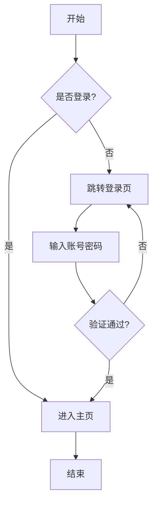
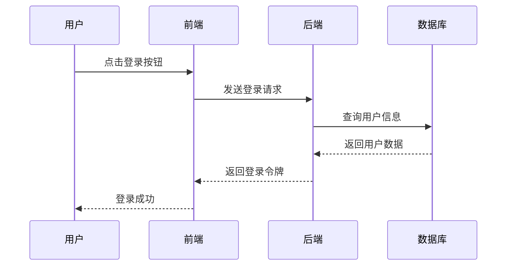
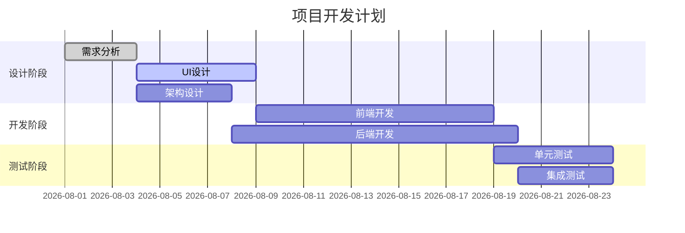
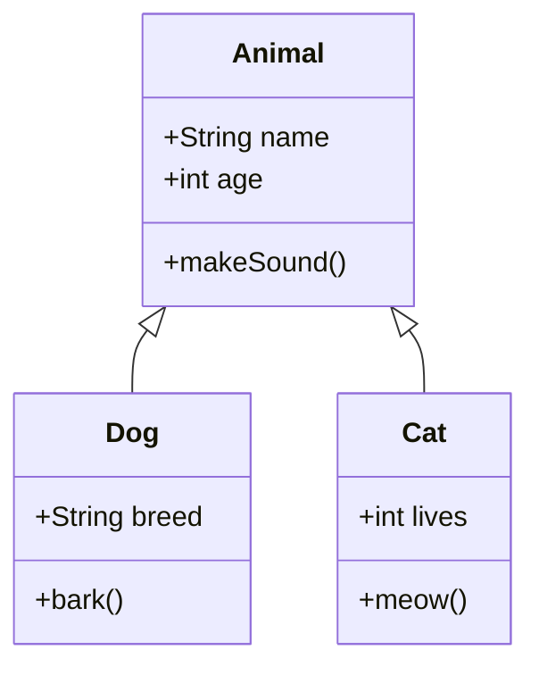
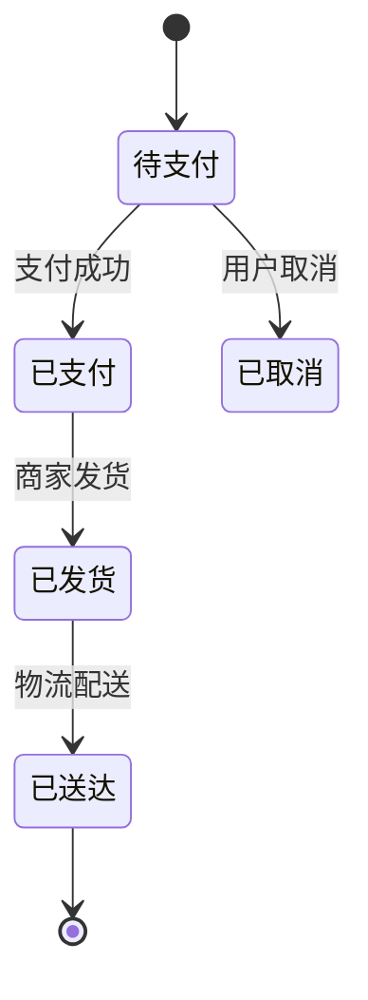
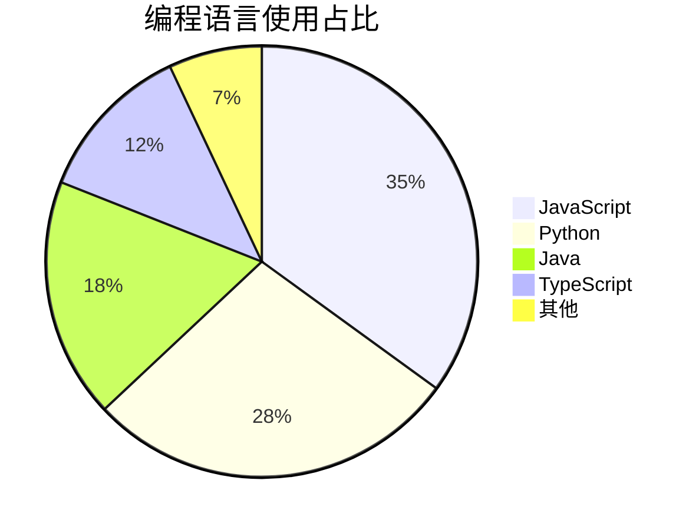
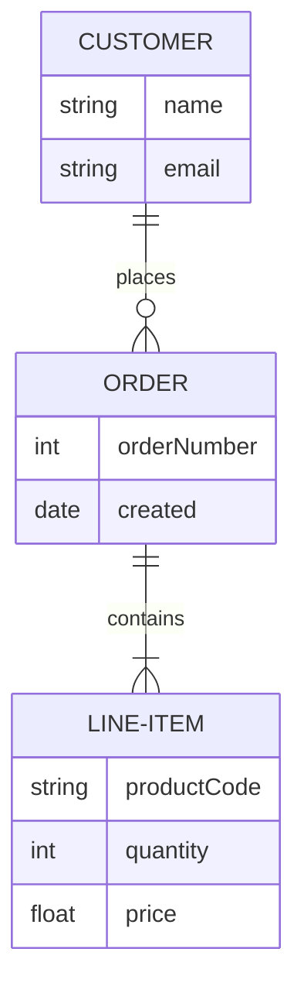
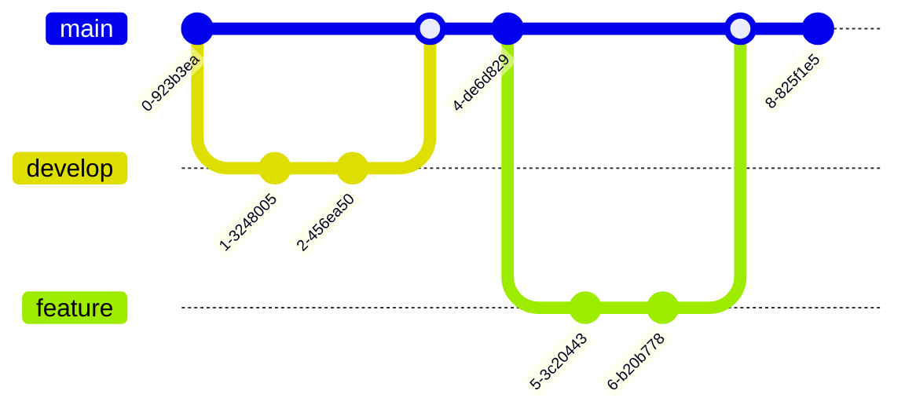

# Mermaid 图表演示

MarkMate 现在支持 Mermaid 图表渲染，包括流程图、时序图、甘特图、类图等多种图表类型。

## 1. 流程图 (Flowchart)



## 2. 时序图 (Sequence Diagram)



## 3. 甘特图 (Gantt Chart)



## 4. 类图 (Class Diagram)



## 5. 状态图 (State Diagram)



## 6. 饼图 (Pie Chart)



## 7. ER图 (Entity Relationship)



## 8. Git提交图 (Git Graph)



## 错误处理示例

语法错误的图表会显示错误提示：

```mermaid
graph TD
    A --> B
    B --> C
    C --> 这是一个语法错误 {{{
```

## 数学公式与图表混合

行内公式：$E = mc^2$

块级公式：

$$
\int_{-\infty}^{\infty} e^{-x^2} dx = \sqrt{\pi}
$$

以上是 Mermaid 支持的主要图表类型，你可以根据需要在文档中使用！
